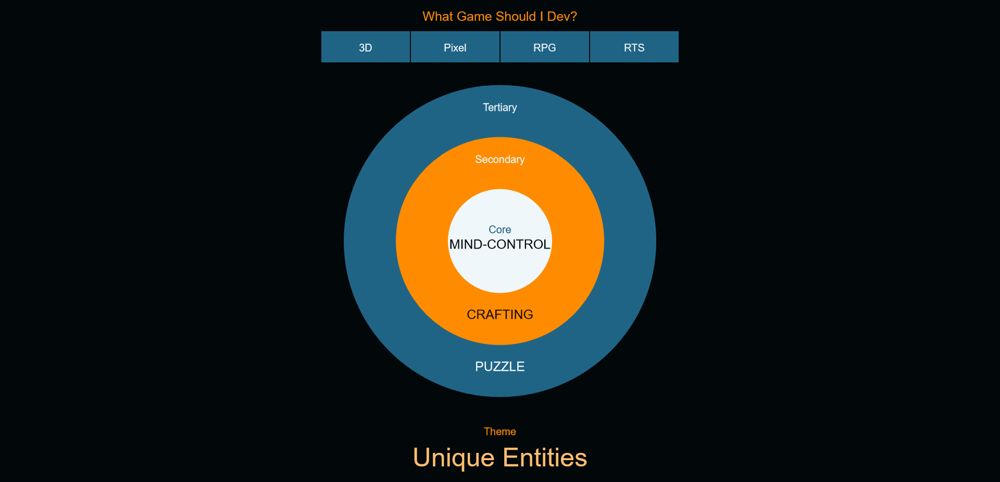

# Game Development Spinner
> When you need a idea to practice your game dev or just for fun.

A Canvas based page, no need to download any additional dependecies just open in browser where you can get an idea for your next great game.

## How to use
Just download a zip of the project and open the spinner.html in your favourite browser. Click to get a new set of constraints for a game. Right click save as a png if you want to save the combination. 

### Make it your own
Just add to the arrays in the resources folder any additional mechanics or graphics etc you would like in the possible set of game ideas. The themes list was grabbed from Ladum Dare (possibly!?) so it is fairly extensive.

### Future addons
Some things that would be nice to have in future
* Ability to save a random seed.
* Ability to set the seeed.

### Example

## Licence

This project is licensed under Unlicense license. This license does not require
you to take the license with you to your project.

